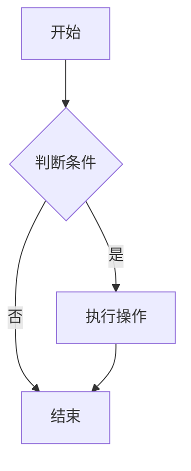
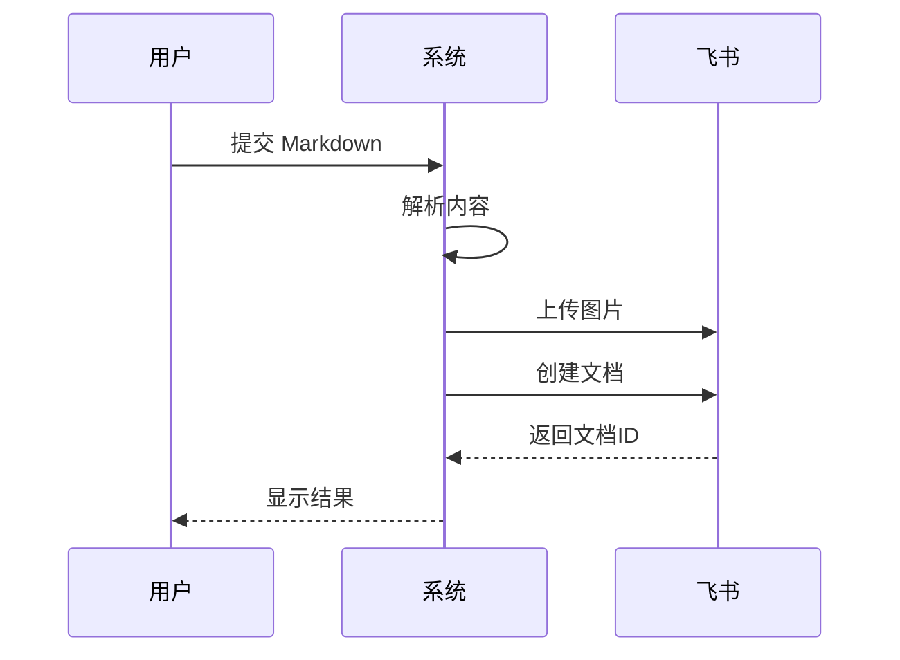

# 测试文档

这是一个测试文档，用于验证 Feishu Markdown Sync 功能。

## 流程图示例



## 序列图示例



## 普通内容

这是一个普通的段落，包含一些 **粗体** 和 *斜体* 文本。

### 代码块

```typescript
function hello(name: string): string {
  return `Hello, ${name}!`;
}
```

## 表格示例

| 功能 | 状态 |
|------|------|
| Markdown 解析 | ✅ |
| Mermaid 图表 | ✅ |
| 图片上传 | ✅ |

## 结束

测试完成！
